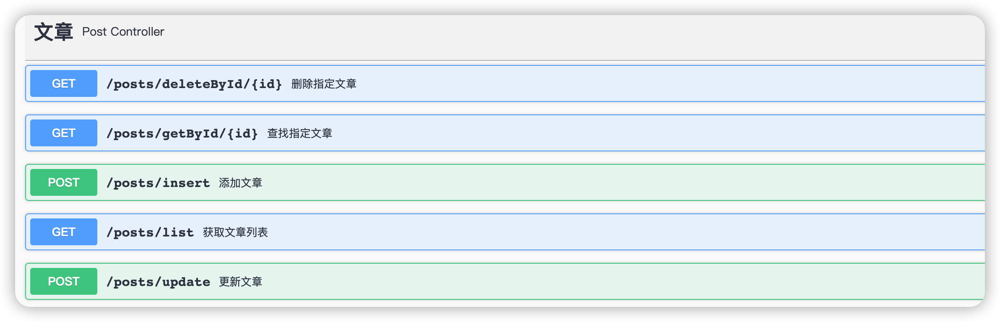

# lobster-blog-api-java

## 🦞小龙虾的博客-后端API-Java版
- 本项目为 [lobster-blog-vue3](https://github.com/imurlobster/lobster-blog-vue3) 的后端API
- powered by SpringBoot2.7

##  项目功能
- swagger
- mybatis
- to do more

## 使用步骤

1.克隆仓库

`git clone https://github.com/imurlobster/lobster-blog-api-java.git`

2.导入MySQL数据sql

src/main/resource/lobster-blog.sql

3.修改配置文件的数据库连接信息

src/main/resource/application.yml 

4.启动项目

浏览器输入 http://localhost:8080/swagger-ui/index.html

点击即可测试接口

